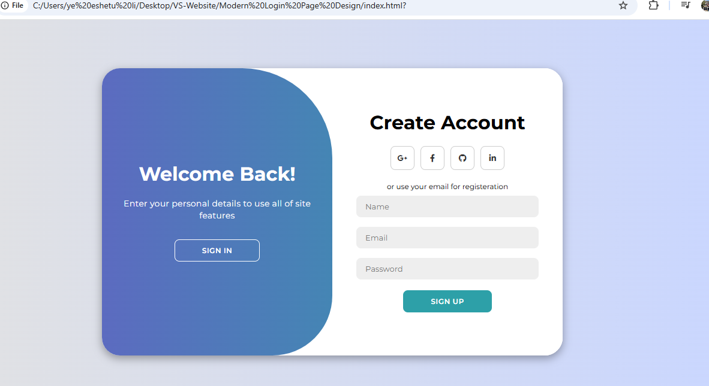

# Modern Login Page Design

This project is a modern and responsive login and registration page design built using HTML, CSS, and JavaScript. It features a toggle animation between the login and registration forms, social media icons, and a clean, user-friendly interface.

## Features

- **Responsive Design**: Works seamlessly on all screen sizes.
- **Toggle Animation**: Smooth transition between login and registration forms.
- **Social Media Integration**: Includes social media icons for platforms like Google, Facebook, GitHub, and LinkedIn.
- **Custom Styling**: Styled with CSS for a modern and professional look.
- **Interactive Buttons**: Buttons to switch between login and registration forms.

## Technologies Used

- **HTML5**: For the structure of the page.
- **CSS3**: For styling and animations.
- **JavaScript**: For interactive functionality.

## How to Use

1. Clone the repository or download the project files.
   ```bash
   git clone <repository-url>
   ```

## Project Structure

Modern Login Page Design/
├── [index.html](http://_vscodecontentref_/1)       # Main HTML file
├── [style.css](http://_vscodecontentref_/2)        # CSS file for styling
├── [script.js](http://_vscodecontentref_/3)        # JavaScript file for interactivity
└── [README.md](http://_vscodecontentref_/4)        # Project documentation



